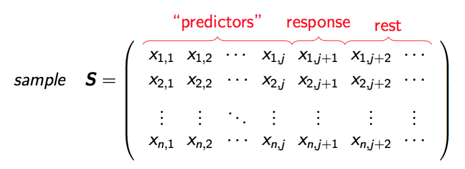
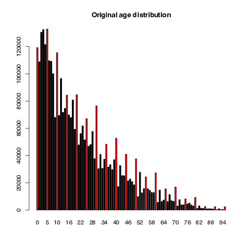

```{r setup, include=FALSE}
knitr::opts_chunk$set(echo = FALSE)
```

## Why synthetic populations? 

- <b>comparison of methods</b>, e.g. in design-based simulation studies
- <b>policy modelling</b> on individual level (e.g health planning, climate change, demographic change, economic change, ...)
- <b>teaching</b> (e.g. teaching of survey methods)
- creation of public-/scientific-use files with (very) <b>low disclosure risk</b>
- data availability is often a problem (legal issues, costs,...)

Remark: We always can draw samples from a population. To generate a population is a more general approach.


## Properties of close-to-reality data 

- actual sizes of regions and strata need to be reflected
- marginal distributions and interactions between variables should be
represented correctly
- hierarchical and cluster structures have to be preserved
- data confidentiality must be ensured
- pure replication of units from the underlying sample should be avoided
- sometimes some marginal distributions must exactly match known values
- calibration: certain marginal distributions should be exactly the same as known from other data sources


## Available information

- choice of methods depends on available information:
    * census
    * survey samples
    * aggregated information from samples
    * known marginal distributions from population


## Methods

1. <b>Synthetic reconstruction</b> / <b>Deterministic reweighting</b> are based on conditional probabilites. Often used in combination with calibration methods (IPF, IPU, HIPF)
2. <b>Combinatorial optimization</b> are used to calibrate populations and to enrich a population e.g. with detailed geographical information (SA, GA)
3. <b>Model-based methods</b> for the simulation of close-to-reality  
populationens using regression methods


## Model-based approach - workflow

Example workflow individuals within households survey data:

<div style="height: 550px; text-align:center">
   
</div>
 


## Model-based approach 

- In general, the procedure consists of four steps:
  * setup of the household structure (with additional variables)
  * simulation of categorical variables
  * simulation of continuous variables
  * the splitting continuous variables into components
- Stratification: allows to account for heterogenities (e.g. regional differences)


## Model-based approach

- Household structure (core-variables): simulated separately for each
combination of strata and household size.
- Number of households: estimated using the HT-estimator
- As few variables as possible (due to confidentiality reasons) are
simulated using a sampling approach
- This builds up a realistic structure of the core variables
- Finally, additional variables are simulated using a regression/ML-based approach using either 
 * all existing variables  
 * a defined model
 * basic structural variables


## (Simplified) Rule

- fit on the sample data  
- using this information, predict on population data

E.g. citizenship is available in the sample but not in the population. 
Build a model on the <b>sample data</b> using predictors that are available on the sample and population. Predict citizenship on the <b>population data</b>.


## Model-based approach - the basic structure file

- <b>direct</b>: estimation of the population totals for each combination of stratum and household size using the Horvitz-Thompson estimator  
- <b>multinom</b>: estimation of the conditional probabilities within the strata using a multinomial log-linear model and random draws from the resulting distributions  
- <b>distribution</b>: random draws from the observed conditional distributions within the strata

Example of variables spanning the basic structure: age × region × sex   
($\forall$ strata & households)

We will see later in a demo:  
#### <b>simStructure()</b>


## Model-based approach 

- Input: survey data   

- Model: variable ∼ covariates (better: model matrix) fitted on sample survey. First predictors are the basic structure variables

- Regression coefficients used to predict on population (do not use expected values)


## Model-based approach - fitting

<div style="width: 90%; text-align:center">
   
</div>

$\longrightarrow$ design matrix to model $\boldsymbol{x}_{j+1}$ (account for interactions, etc.).    
$\longrightarrow$ estimation of the $\boldsymbol{\beta}$'s 

## Model-based approach - prediction

<div style="width: 90%; text-align:center">
   
</div>

we don't took expected values but draw from predictive distributions


## Model-based approach - categorical variables

Estimation of the $\boldsymbol{\beta}$'s 

- <b>multinom</b>: estimation of the conditional probabilities using multinomial log-linear models and random draws from the resulting distributions. Can deal with structural zeros.  
- <b>distribution</b>: random draws from the observed conditional distributions of their multivariate realizations  
- <b>ctree</b>: for using classification trees  
- <b>ranger</b>: for using random forest


#### <b>simCategorical()</b>


## Model-based approach - continuous variables


Similar to the categorical case, but models differ.

- <b>multinom</b>: categorize first, then draw from the predictive distributions
- <b>lm</b>: for using (two-step) regression models combined with random error terms  
- <b>glm's</b>, e.g. <b>poisson</b> for using Poisson regression for count variables  
- robust methods
- <b>ranger</b>: for using random forest

#### <b>simContinuous()</b>


## Model-based approach - more methods

### Components:
- by resampling fractions from survey data (<b>simComponents()</b>)
  
### Relations:
- taking relationships between household members into account (<b>simRelation()</b>)

### Spatial:  
- generation of smaller regions given an existing spatial variable and a table (<b>simSpatialInit()</b>)


## R package simPop

- Templ, Kowarik, and Meindl (2017), Journal of Statistical Software (accepted)
- latest version on [CRAN](http://cran.r-project.org/web/packages/simPop/index.html)
- development on [github](https://github.com/statistikat/simPop)
- parallel computing is applied automatically  
- efficient implementation

## Special classes in simPop 

simPop uses S4 classes, the most important classes defined: 

- <b>dataObj</b>: Contains <b>information</b> on the population and <b>survey data</b>
to be used as input for the generation of the synthetic population. Typically, information on the variables containing the household and person IDs, household size, sampling weights, stratification information, and type of data (i.e., sample or a population).  
- <b>simPopObj</b>: Contains information on the <b>sample</b> (in slot sample), the
<b>population</b> (slot pop), and optionally some margins in the form of a <b>table</b> (slot table).
Objects in slot sample and pop must be objects of class <b>dataObj</b>. 


## Define the structure  

Create an object of class *dataObj* with function **specifyInput()**. 


```r
inp <- specifyInput(data=origData, 
                    hhid="db030", 
                    hhsize="hsize", 
                    strata="db040", 
                    weight="rb050")
```


```r
class(inp)
```

```
## [1] "dataObj"
## attr(,"package")
## [1] "simPop"
```


## Print the dataObj


```r
inp
```

```
## 
##  --
## survey sample of size 11725 x 19 
## 
##  Selected important variables: 
## 
##  household ID: db030
##  personal ID: pid
##  variable household size: hsize
##  sampling weight: rb050
##  strata: db040
##  --
```


## Simulating the basic structural variables 


```r
synthP <- simStructure(data=inp, 
                       method="direct", 
                       basicHHvars=c("age", "rb090", "db040"))
class(synthP)
```

```
## [1] "simPopObj"
## attr(,"package")
## [1] "simPop"
```

- output object (*"synthP"*) is of class *simPopObj*
- various functions can be applied to such objects


## Simulation of categorical variables 
```r
synthP <- simCategorical(synthP, additional=c("pl030", "pb220a"),
  method="multinom")
synthP
```

```
## 
## --
## synthetic population  of size 
##  8182010 x 9 
## 
## build from a sample of size 
## 11725 x 19
## --
## 
## variables in the population:
## db030,hsize,age,rb090,db040,pid,weight,pl030,pb220a
```

## Simulating continuous variables  
```r
# multinomial model with random draws
synthP <- simContinuous(synthP, additional="netIncome",
    upper=2e+05, equidist=FALSE) 
synthP
```

```
## 
## --
## synthetic population  of size 
##  8182010 x 11 
## 
## build from a sample of size 
## 11725 x 19
## --
## 
## variables in the population:
## db030,hsize,age,rb090,db040,pid,weight,pl030,pb220a,netIncomeCat,netIncome
```

- Simulation of components with **simComponents()**


## Census information to calibrate 

- Assumption: external information (n-dimensional table) is available, e.g marginals on *region* $\times$ *gender* $\times$ *exonomic status*.


```r
margins
```

<font size="6">  

```
##            db040  rb090 pb220a freq
## 1     Burgenland   male     AT  797
## 2  Lower Austria   male     AT 4363
## 3         Vienna   male     AT 3749
## 4      Carinthia   male     AT 1568
## 5         Styria   male     AT 3139
## 6  Upper Austria   male     AT 3741
## 7       Salzburg   male     AT 1379
## 8          Tyrol   male     AT 1566
## 9     Vorarlberg   male     AT  819
## 10    Burgenland female     AT  821
## 11 Lower Austria female     AT 4426
## 12        Vienna female     AT 4357
## 13     Carinthia female     AT 1729
## 14        Styria female     AT 3354
## 15 Upper Austria female     AT 3962
## 16      Salzburg female     AT 1508
## 17         Tyrol female     AT 1886
## 18    Vorarlberg female     AT  902
## 19    Burgenland   male     EU   26
## 20 Lower Austria   male     EU   53
...
```
</font> 


## Census information to calibrate 

- We add these marginals to the object and calibrate afterwards 

```r
synthP <- addKnownMargins(synthP, margins) # add margins
```


```r
# calibration using simulated annealing
synthPadj <- calibPop(synthP, split="db040", temp=1, 
                      eps.factor=0.00005, maxiter=200, 
                      temp.cooldown=0.975, 
                      factor.cooldown=0.85, 
                      min.temp=0.001, verbose=TRUE)
```

Now: margins of the sample <b>equals known margins of the population</b>
(not shown here, calculation time between 45 min and some hours)


## Results
```r
tab <- spTable(synthP, select=c("rb090","db040","hsize"))
spMosaic(tab, labeling=labeling_border(abbreviate=c(db040=TRUE)))
```
```{r, out.width = "500px"}

```


## Results
```r
tab <- spTable(synthP, select = c("rb090", "pl030"))
spMosaic(tab, method = "color")
```
```{r, out.width = "500px"}
knitr::include_graphics("imgs/plot_mosaic2.png")
```


## Results
```r
spCdfplot(synthPadj, "netIncome", cond="db040", layout=c(3, 3))
```
```{r, out.width = "500px"}
knitr::include_graphics("imgs/cdfs.png")
```


## Other features of simPop

age heaping

```{r, out.width = "500px"}

```


## Other features of simPop

Correct for age heaping using truncated (log-)normal distributions on individual level (function <b>correctHeap()</b>)

```{r, out.width = "500px"}
knitr::include_graphics("imgs/age4.png")
```


## Conclusions

- Structure of original input data is preserved
- Margins of synthetic populations are calibrated
- The synthetic populations are confidential
- Code of **simPop** is quite efficient
- Many methods are ready to be used