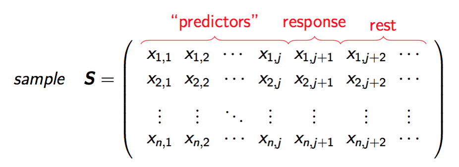
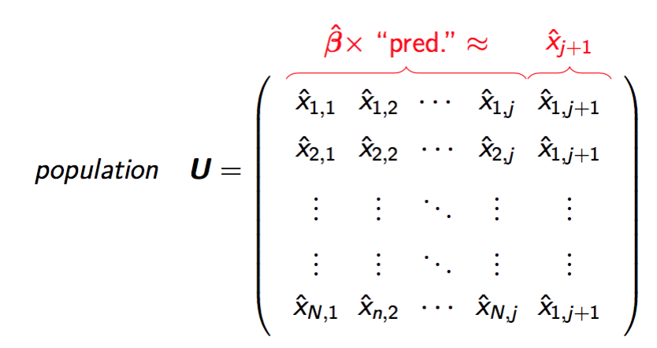
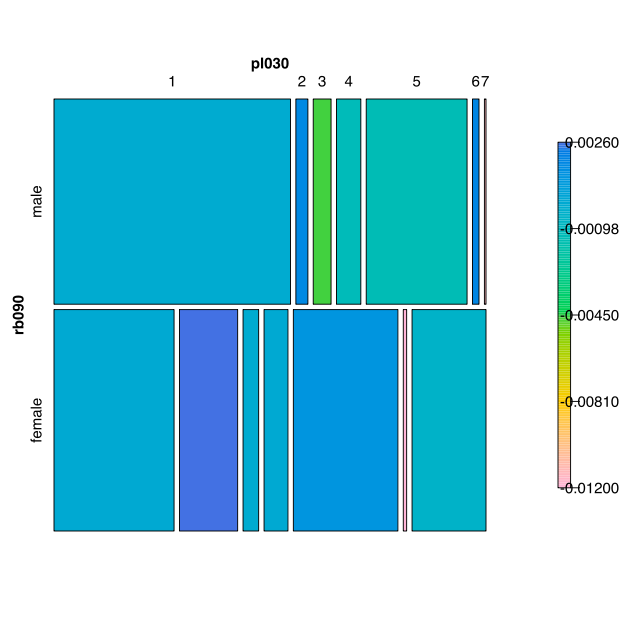
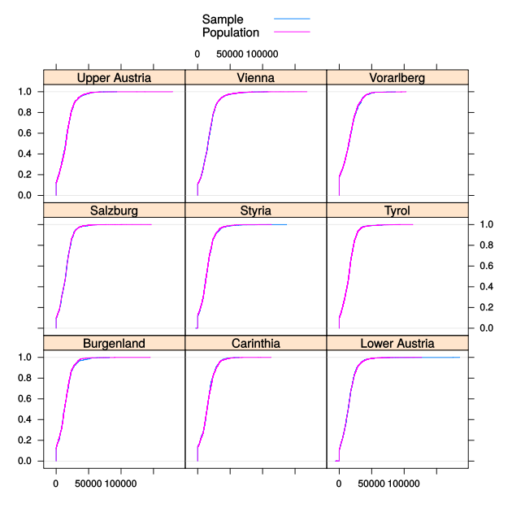
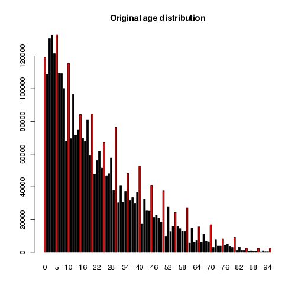
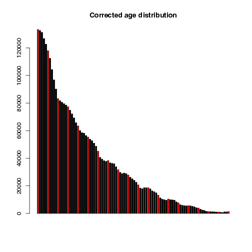

```{r setup, include=FALSE}
knitr::opts_chunk$set(echo = FALSE)
```

## Why synthetic populations? 

- <b>comparison of methods</b>, e.g. in design-based simulation studies
- <b>policy modelling</b> on individual level (e.g health planning, climate change, demographic change, economic change, ...)
- <b>teaching</b> (e.g. teaching of survey methods)
- creation of public-/scientific-use files with (very) <b>low disclosure risk</b>
- data availability is often a problem (legal issues, costs,...)

Remark: We always can draw samples from a population. To generate a population is a more general approach.


## Properties of close-to-reality data 

- actual sizes of regions and strata need to be reflected
- marginal distributions and interactions between variables should be
represented correctly
- hierarchical and cluster structures have to be preserved
- data confidentiality must be ensured
- pure replication of units from the underlying sample should be avoided
- sometimes some marginal distributions must exactly match known values
- calibration: certain marginal distributions should be exactly the same as known from other data sources


## Available information

- choice of methods depends on available information:
    * census
    * survey samples
    * aggregated information from samples
    * known marginal distributions from population

## Model-based approach 

- In general, the procedure consists of four steps:
  * setup of the household structure (with additional variables)
  * simulation of categorical variables
  * simulation of continuous variables
  * the splitting continuous variables into components
- Stratification: allows to account for heterogenities (e.g. regional differences)

## Model-based approach - the basic structure file

- <b>direct</b>: estimation of the population totals for each combination of stratum and household size using the Horvitz-Thompson estimator  
- <b>multinom</b>: estimation of the conditional probabilities within the strata using a multinomial log-linear model and random draws from the resulting distributions  
- <b>distribution</b>: random draws from the observed conditional distributions within the strata

Example of variables spanning the basic structure: age × region × sex   
($\forall$ strata & households)


## Model-based approach - fitting

<div style="width: 90%; text-align:center">
   
</div>

$\longrightarrow$ design matrix to model $\boldsymbol{x}_{j+1}$ (account for interactions, etc.).    
$\longrightarrow$ estimation of the $\boldsymbol{\beta}$'s 

## Model-based approach - prediction

<div style="width: 90%; text-align:center">
   
</div>

we don't took expected values but draw from predictive distributions


## Model-based approach - categorical variables

Estimation of the $\boldsymbol{\beta}$'s 

- <b>multinom</b>: estimation of the conditional probabilities using multinomial log-linear models and random draws from the resulting distributions. Can deal with structural zeros.  
- <b>distribution</b>: random draws from the observed conditional distributions of their multivariate realizations  
- <b>ctree</b>: for using classification trees  
- <b>ranger</b>: for using random forest


#### <b>simCategorical()</b>


## Model-based approach - continuous variables


Similar to the categorical case, but models differ.

- <b>multinom</b>: categorize first, then draw from the predictive distributions
- <b>lm</b>: for using (two-step) regression models combined with random error terms  
- <b>glm's</b>, e.g. <b>poisson</b> for using Poisson regression for count variables  
- robust methods
- <b>ranger</b>: for using random forest

#### <b>simContinuous()</b>


## Model-based approach - more methods

### Components:
- by resampling fractions from survey data (<b>simComponents()</b>)
  
### Relations:
- taking relationships between household members into account (<b>simRelation()</b>)

### Spatial:  
- generation of smaller regions given an existing spatial variable and a table (<b>simSpatialInit()</b>)


## R package simPop

- Templ, Kowarik, and Meindl (2017), Journal of Statistical Software (accepted)
- latest version on [CRAN](http://cran.r-project.org/web/packages/simPop/index.html)
- development on [github](https://github.com/statistikat/simPop)
- parallel computing is applied automatically  
- efficient implementation

## Define the structure  

Create an object of class *dataObj* with function **specifyInput()**. 


```r
inp <- specifyInput(data=origData, 
                    hhid="db030", 
                    hhsize="hsize", 
                    strata="db040", 
                    weight="rb050")
```


```r
class(inp)
```

```
## [1] "dataObj"
## attr(,"package")
## [1] "simPop"
```

## Simulating the basic structural variables 


```r
synthP <- simStructure(data=inp, 
                       method="direct", 
                       basicHHvars=c("age", "rb090", "db040"))
class(synthP)
```

```
## [1] "simPopObj"
## attr(,"package")
## [1] "simPop"
```

- output object (*"synthP"*) is of class *simPopObj*
- various functions can be applied to such objects


## Simulation of categorical variables 
```r
synthP <- simCategorical(synthP, additional=c("pl030", "pb220a"),
  method="multinom")
synthP
```

```
## 
## --
## synthetic population  of size 
##  8182010 x 9 
## 
## build from a sample of size 
## 11725 x 19
## --
## 
## variables in the population:
## db030,hsize,age,rb090,db040,pid,weight,pl030,pb220a
```

almost the same for *simContinuous()*


## Census information to calibrate 

- We add these marginals to the object and calibrate afterwards 

```r
synthP <- addKnownMargins(synthP, margins) # add margins
```


```r
# calibration using simulated annealing
synthPadj <- calibPop(synthP, split="db040", temp=1, 
                      eps.factor=0.00005, maxiter=200, 
                      temp.cooldown=0.975, 
                      factor.cooldown=0.85, 
                      min.temp=0.001, verbose=TRUE)
```

Now: margins of the sample <b>equals known margins of the population</b>
(not shown here, long computation time.)


## Results
```r
tab <- spTable(synthP, select = c("rb090", "pl030"))
spMosaic(tab, method = "color")
```
```{r, out.width = "500px"}

```


## Results
```r
spCdfplot(synthPadj, "netIncome", cond="db040", layout=c(3, 3))
```
```{r, out.width = "500px"}

```


## Other feature of simPop - age heaping
Correct for age heaping using truncated (log-)normal distributions on individual level (function <b>correctHeap()</b>)

```{r, out.width = "400px",fig.show='hold'}


```


## Conclusions

- Structure of original input data is preserved
- Margins of synthetic populations are calibrated
- The synthetic populations are confidential
- Code of **simPop** is quite efficient
- Many methods are ready to be used